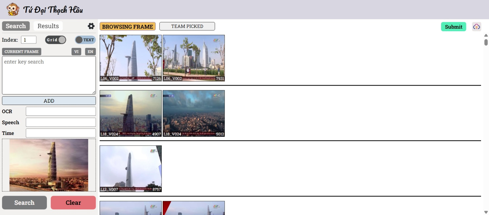
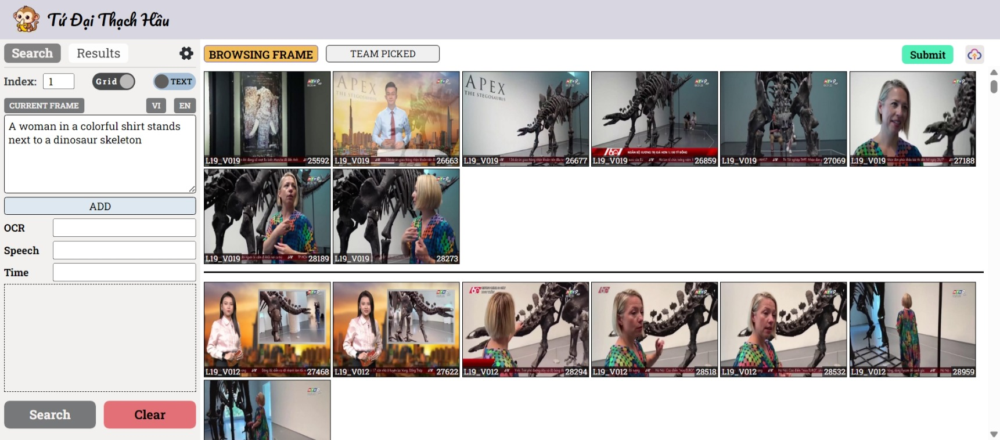
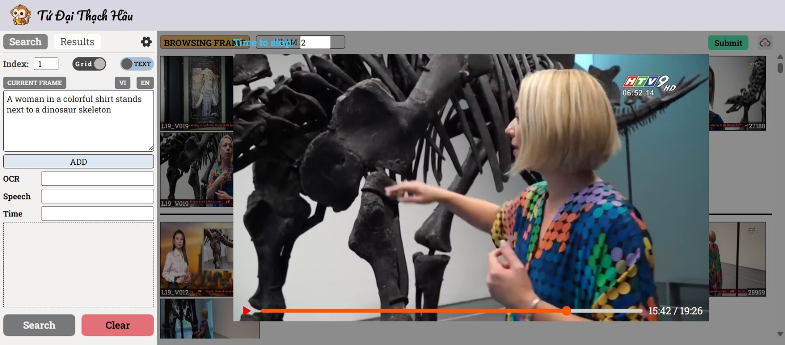
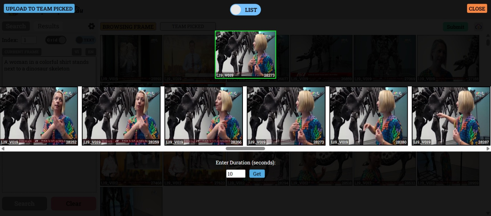
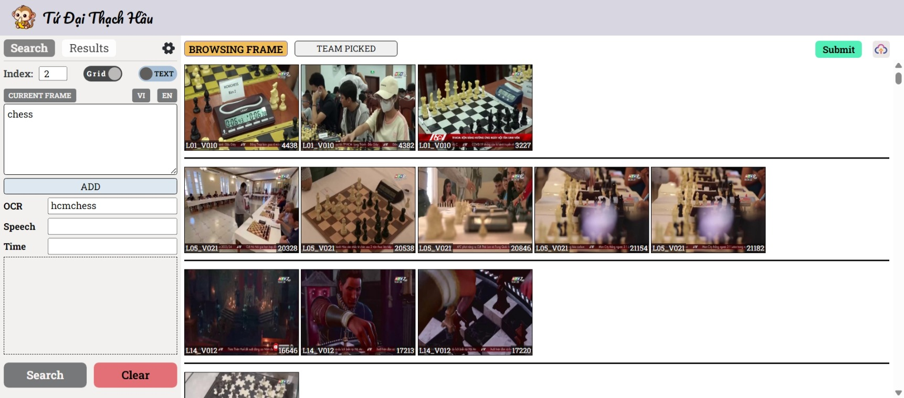
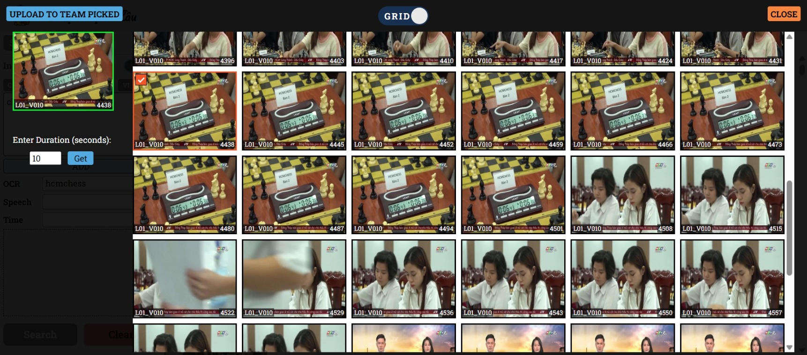

<h1 align="center">AI Challenge 2024 - Query Events from Video</h1>

  <b>Team:</b> Tứ Đại Thạch Hầu

 <b>Members:</b> Khanh Duy Ho, Minh Duy Nguyen, Van Diep Tran, Hong Son Nguyen

  

## Project Description

This project builds a video retrieval system based on text, image and audio queries. The system uses deep learning models and vector databases to speed up the query and ensure high accuracy when searching for relevant content in videos.

## System Overview

The system consists of a frontend built with **ReactJS** and a backend implemented using **FastAPI**:

- **Frontend (ReactJS):** Provides a user-friendly interface that allows users to input their queries in various forms (text, image, audio) and displays search results in a visually appealing manner.
- **Backend (FastAPI):** Manages the processing of queries, communicates with the deep learning models, and handles interactions with the vector database (Milvus) and Elasticsearch for efficient data retrieval.

Some pictures of the system:
|  |  |  |
| ---------------------------------- | ---------------------------------- | ---------------------------------- |
|  |  |  |
|  |  |  |

## Implementation process

### 1. Video Processing and Frame Selection

- **Crop and select frames:** The input video is cut into consecutive frames. Duplicate frames or frames without new information are discarded based on the similarity of the embedding vector.
- **Embedding and comparison:** Use CLIP and CLIP4Clip models to represent frames and queries as embedding vectors. The similarity between the query and frames is calculated based on `cosine similarity`.
  $$
  \text{cosine similarity}(A, B) = \frac{A \cdot B}{\|A\| \|B\|}
  $$

### 3. Extract Information from Video

- **OCR (Optical Character Recognition):** Use OCR to extract text from video frames, adding more information to the frames, increasing search accuracy.
- **Voice recognition:** Extract subtitles from YouTube videos to add semantic information to video content, improving the searchability of videos with dialogue.

### 2. Vector Database and Query Acceleration

- **Milvus:** The system uses Milvus to store and query frame embedding vectors. Milvus supports efficient index creation, which reduces query time and speeds up result return.
- **Elasticsearch:** In addition to Milvus, the system uses Elasticsearch for indexing and searching OCR (Optical Character Recognition) text and transcribed voice data. This enables fast retrieval of textual information extracted from video frames and audio, enhancing the search capabilities for videos containing specific text or spoken content.

### 4. Reranking and Query Combining

- The system performs reranking of search results based on different query types (text, image, OCR, voice). This ensures that results with the highest similarity to the user's query are returned.

### 5. System Implementation
