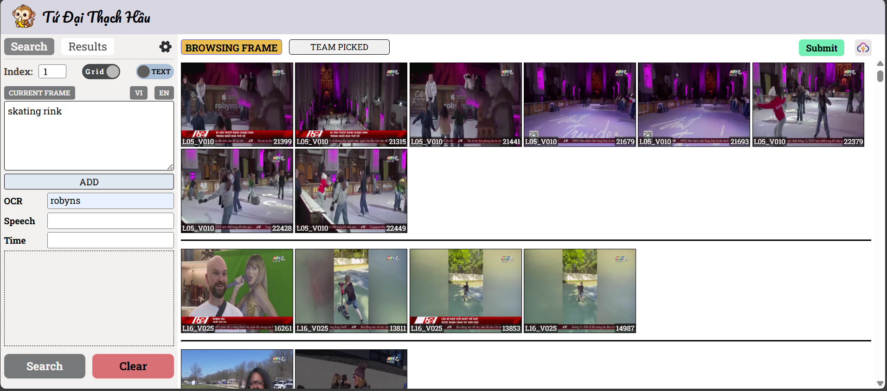
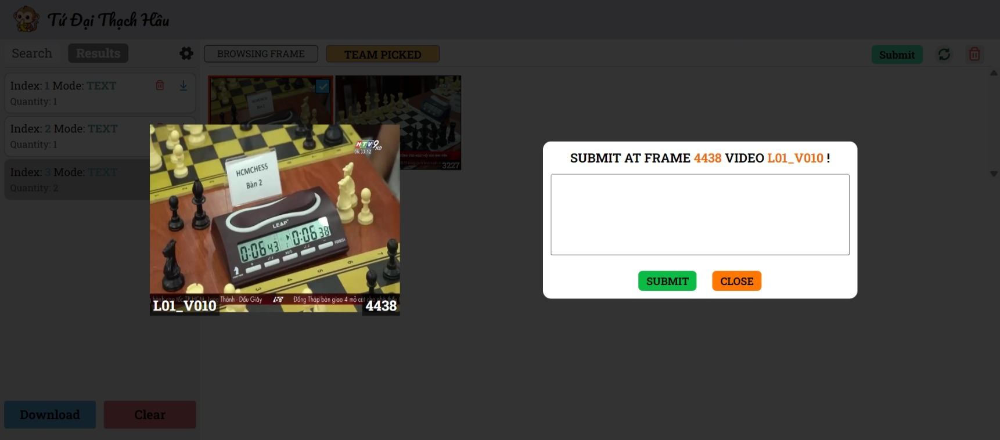

  
  <!-- **THAY THẾ 'assets/your_project_logo_or_banner.png' BẰNG LOGO HOẶC BANNER DỰ ÁN CỦA BẠN (NẾU CÓ)** -->

<h1 align="center">AI Challenge 2024 - Multi-Modal Video Event Retrieval</h1>

  <em>A sophisticated system for querying and retrieving specific events from videos using text, image, and audio inputs.</em>

  
  <!-- You can add more badges like build status, license, etc. -->

  <b>Team:</b> Tứ Đại Thạch Hầu
   
  <b>Members:</b> Khanh Duy Ho, Minh Duy Nguyen, Van Diep Tran, Hong Son Nguyen

  
  <!-- Consider adjusting width and adding a border-radius for a polished look -->

---

## 🌟 Project Overview

This project introduces an advanced **video retrieval system** designed to accurately and efficiently locate specific events within video content based on diverse query types: **text, image, and audio**. By harnessing the power of cutting-edge deep learning models and robust vector databases, our system significantly accelerates the query process while maintaining high precision in identifying relevant video segments.

---

## 🚀 System Architecture

Our solution is architected with a user-centric frontend and a powerful backend, ensuring a seamless and effective user experience:

- 🎨 **Frontend (ReactJS):**

  - Delivers an intuitive and interactive user interface.
  - Allows users to effortlessly submit queries through text input, image uploads, or audio recordings.
  - Presents search results in a clear, organized, and visually engaging manner.

- ⚙️ **Backend (FastAPI):**
  - Serves as the core processing engine, intelligently handling multi-modal queries.
  - Orchestrates communication with sophisticated deep learning models for feature extraction and understanding.
  - Manages high-performance interactions with **Milvus** (for vector similarity search) and **Elasticsearch** (for textual data indexing and search), ensuring rapid and accurate data retrieval.

---

## 🖼️ System Snapshots

A glimpse into our system's interface and capabilities:

  <table>
    <tr>
      <td align="center"> Query Input Interface</td>
      <td align="center"> Image Query Results</td>
      <td align="center"> Text Query Results</td>
    </tr>
    <tr>
      <td align="center"> Detailed Frame View</td>
      <td align="center"> Audio Query Processing</td>
      <td align="center"> Ranked Search Results</td>
    </tr>
     <tr>
      <td align="center"> Additional View 1</td>
      <td align="center"> Additional View 2</td>
      <td align="center"> Additional View 3</td>
    </tr>
  </table>

---

## 🛠️ Core Implementation Details

Our system employs a multi-stage process to deliver accurate and fast video retrieval:

### 1. Intelligent Video Processing & Frame Selection

- **Frame Segmentation & Deduplication:** Input videos are meticulously segmented into constituent frames. To optimize processing and storage, redundant or non-informative frames are intelligently discarded by analyzing the similarity of their embedding vectors.
- **Embedding Generation & Similarity Matching:** We utilize state-of-the-art models like **CLIP** and **CLIP4Clip** to transform both video frames and user queries into rich, high-dimensional embedding vectors. The relevance between a query and video frames is then precisely quantified using `cosine similarity`.
  

    
     <em>Conceptual representation of Cosine Similarity.</em>
  

### 2. Multi-Modal Information Extraction

- **Optical Character Recognition (OCR):** OCR technology is employed to extract textual information directly from video frames. This enriches the metadata associated with each frame, significantly boosting search accuracy for queries containing specific text.
- **Automated Speech Recognition (ASR):** For videos with spoken content (e.g., from YouTube), subtitles or transcriptions are extracted. This adds a crucial layer of semantic information, enabling effective retrieval based on spoken dialogue.

### 3. High-Performance Data Indexing & Retrieval

- **Milvus Vector Database:** The core of our similarity search relies on Milvus, a highly scalable and efficient open-source vector database. Milvus stores and indexes the embedding vectors of video frames, facilitating rapid similarity searches through optimized indexing structures (e.g., HNSW, IVF_FLAT), which dramatically reduces query latency.
- **Elasticsearch Integration:** Complementing Milvus, Elasticsearch is utilized for robust indexing and searching of textual data extracted via OCR and ASR. This dual-database approach allows for powerful hybrid searches, combining semantic vector similarity with keyword-based textual matching.

### 4. Advanced Result Reranking & Query Fusion

- To provide the most pertinent results, the system incorporates a sophisticated **reranking mechanism**. Search results originating from different query modalities (text, image, OCR, ASR) and feature extractors are intelligently combined and re-ordered, ensuring that the final output optimally aligns with the user's intent.

  <em>Thank you for exploring our AI Challenge 2024 project!</em>

